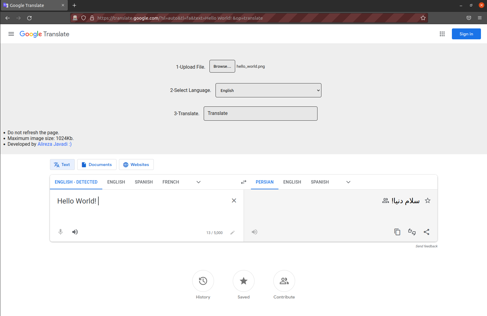

# Image Translation
 Simple app to translate text inside image.This app use [Google Translate](https://translate.google.com) website and [OCR Space](https://ocr.space) APIs. 

# How To Use
- Get your free API Key from [here](http://ocr.space/ocrapi/freekey) and paste it in `image_translation/api_key.txt` file.
    - Default API Key is `helloworld`,it is just for test.
- Install requirements.
    - `pip install -r requirements.txt`
- Run!
    - `python main.py`
#Support
- Image file formats:
    - .png
    - .jpeg
    - .jpg
    - .gif
    - .tif
    - .bmp
- Text language(text in image):
    - English
    - Arabic
    - Chinese
    - German
    - Russian
    - Turkish
    - [and more...](http://ocr.space/OCRAPI)
     
# License
This project is released under the MIT License.

# Image
| Image |
| --- |
| 
